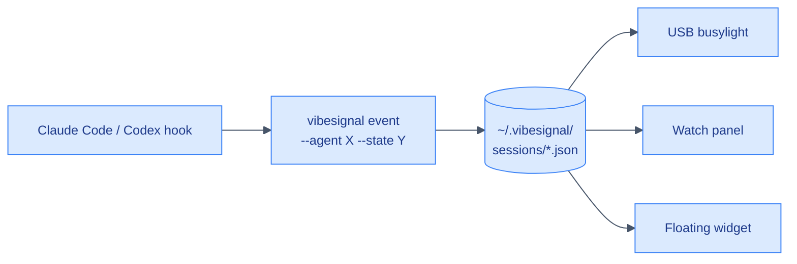

<div align="center">

# VibeSignal

**A physical USB status light for AI coding agents (Claude Code, Codex)**

[](https://pypi.org/project/vibesignal/)
[](LICENSE)
[](https://www.python.org)
[](#whats-next)
[](https://github.com/yzhao062/vibesignal)

[Install](#install) · [Quickstart](#quickstart) · [How It Works](#how-it-works) · [Three Renderers](#three-renderers) · [Configure Agents](#configure-agents) · [What's Next](#whats-next)

</div>

> [!NOTE]
> **The light is the point.** When Claude Code or Codex needs your reply, a USB light on your desk turns amber. When an agent finishes its turn, it turns blue. While an agent is working, green. A light on the desk is harder to miss than one more notification in the corner of a screen you are already ignoring.

No light on your desk yet? The same signal renders on screen, so you can run VibeSignal today and add the hardware later. The always-on-top widget below stays calm grey while agents work, and turns red the moment a session blocks for your input.

<p align="center">

</p>

## What You Get

- 🟢 **Solid colors, daemon-free:** the state persists in the hardware after the hook exits; no service to keep alive
- 🪝 **Hook-driven:** `UserPromptSubmit`, `PostToolUse`, `Notification`, `Stop`, `SessionEnd` all wire in via JSON
- 🤖 **Cross-agent:** the same store covers Claude Code and Codex; one light tracks both
- 📺 **Three renderers:** USB busylight (hardware), terminal watch panel, always-on-top Tk widget
- 🚦 **Multi-session aware:** runs 4–5 agents in parallel; the widget shows which one is blocked
- 🖱️ **One-click on macOS and Windows:** `install-launcher` + `install-autostart` wire a native launcher and login autostart (`.app` + LaunchAgent on macOS; Start menu, Desktop, and Startup shortcuts on Windows)
- 🪟 **Cross-platform:** Windows, macOS, Linux; per-platform fonts and work-area detection

## Install

```bash
pip install vibesignal
```

On macOS, add the `macos` extra for accurate Dock-aware widget placement:

```bash
pip install 'vibesignal[macos]'
```

<details>
<summary>Install the latest unreleased build from GitHub</summary>

```bash
pip install 'vibesignal @ git+https://github.com/yzhao062/vibesignal.git'

# with the macOS extra:
pip install 'vibesignal[macos] @ git+https://github.com/yzhao062/vibesignal.git'
```

</details>

The [Quickstart](#quickstart) below wires the one-click launcher and login autostart on macOS and Windows. On Linux, add a `.desktop` entry under `~/.config/autostart/` that runs `vibesignal widget`, then [configure your agents](#configure-agents) to fire the hooks.

## Quickstart

Only the install line differs by OS; the setup commands are the same. Wire the Claude Code hooks once (see [Configure Agents](#configure-agents)), then:

**1. Install** (macOS adds the `macos` extra for accurate Dock-aware widget placement):

```bash
pip install 'vibesignal[macos]'   # macOS
pip install vibesignal            # Windows
```

**2. Set up** (identical on macOS and Windows):

```bash
vibesignal install-hooks       # wire agent hooks (absolute path pinned; add --agent codex for Codex)
vibesignal install-launcher    # macOS: Spotlight-able .app; Windows: Start menu + Desktop shortcut
vibesignal install-autostart   # starts the widget now and at every login
vibesignal status              # verify: active sessions + resolved color
```

After `install-autostart`, a small panel appears in the bottom-left of your screen. When any session blocks for permission, the panel turns red and shows which session.

<details>
<summary><b>macOS daily lifecycle</b> (show or quit the widget, autostart controls)</summary>

| Action | Command |
|---|---|
| Show widget on demand | Cmd+Space → `VibeSignal` → Enter (Spotlight); or `vibesignal widget &` |
| Quit widget window | Right-click or `Control`-click header → Quit |
| Force-kill a running widget | `pkill -f "vibesignal.widget"` |
| Start the LaunchAgent right now (no relogin) | `launchctl kickstart gui/$UID/io.github.yzhao062.vibesignal` |
| Disable autostart, keep launcher | `vibesignal uninstall-autostart` |
| Re-enable autostart later | `vibesignal install-autostart` (idempotent) |
| Remove the `.app` launcher | `vibesignal uninstall-launcher` |
| Inspect autostart status | `launchctl print gui/$UID/io.github.yzhao062.vibesignal` |
| Tail autostart logs | `tail /tmp/io.github.yzhao062.vibesignal.log /tmp/io.github.yzhao062.vibesignal.err` |
| Wire/re-pin agent hooks (idempotent) | `vibesignal install-hooks` (add `--agent codex` for Codex) |
| Remove agent hooks | `vibesignal uninstall-hooks` (add `--agent codex` for Codex) |
| Re-pin paths after switching conda env | `vibesignal install-autostart && vibesignal install-hooks` |
| Manually clear stuck sessions | `vibesignal clear` (all) or `vibesignal clear --session <id>` |

</details>

<details>
<summary><b>Windows daily lifecycle</b> (show or quit the widget, autostart controls)</summary>

| Action | Command |
|---|---|
| Show widget on demand | Start menu → type `VibeSignal`; or the Desktop shortcut; or `pythonw -m vibesignal widget` |
| Quit widget window | Right-click the header → Quit |
| Disable autostart, keep launcher | `vibesignal uninstall-autostart` |
| Re-enable autostart later | `vibesignal install-autostart` (idempotent) |
| Remove the launcher shortcuts | `vibesignal uninstall-launcher` |
| Re-pin paths after switching conda env | `vibesignal install-autostart` |
| Manually clear stuck sessions | `vibesignal clear` (all) or `vibesignal clear --session <id>` |

</details>

## How It Works

Every hook invocation does the full cycle and exits. Nothing has to stay running.



Each hook fires `vibesignal event`, which writes one JSON file per (agent, session), reads every active file, resolves the aggregate state by priority (`blocked > error > done > working > idle`), and updates the USB light if the color changed. Sessions that stop emitting events drop off after their per-state TTL.

Concurrent hooks stay honest two ways. The record-resolve-apply cycle holds a short cross-process lock, so two sessions firing at once cannot leave the light on a lower-priority color (a finishing `working` hook overwriting a fresh `blocked` event from another session). Every state file is written atomically (`tempfile` plus `os.replace`), so a reader never sees a half-written file. The lock is bounded: if it cannot be taken quickly it gives up and proceeds, because never blocking the agent's hook matters more than perfect ordering under rare contention.

## State Table

| State | Light | Set by (Claude Code hook) | Meaning |
|-------|-------|---------------------------|---------|
| `blocked` | Amber, solid | `Notification` (`permission_prompt`) | An agent needs you now |
| `done` | Blue, solid | `Stop`, `StopFailure`, `Notification` (`idle_prompt`) | An agent finished its turn; your move |
| `working` | Green, solid | `UserPromptSubmit`, `PostToolUse` | An agent is busy, do not interrupt |
| `error` | Red, solid | Manual only | A failure |
| `idle` | Off | TTL timeout, done-fade | Nothing needs you |

Aggregate priority across active sessions: `blocked > error > done > working > idle`. If any one agent is waiting on you, the light is amber, so the signal you care about most is never hidden.

## Three Renderers

| Renderer | Command | Where It Lives |
|---|---|---|
| 🟢 **USB busylight** | Driven automatically by every `event` call | Physical light on the desk |
| 📋 **Watch panel** | `vibesignal watch` | Live multi-session TUI in a terminal pane |
| 🪟 **Floating widget** | `vibesignal widget` | Always-on-top Tk window |

All three read the same state store, so they stay in sync. The widget shows which session is blocked when several agents run at once. The USB light shows the highest-priority state across all sessions.

### Watch Panel

```bash
vibesignal watch
```

Live table, one row per active session, blocked rows first:

```
  PROJECT          AGENT    STATE      FOR
* aegis            claude   * blocked  1m12s
* agent-audit      codex    * blocked  8s
o iet-paper        claude   o done     3s
. random           claude   . working  --
```

Foreground viewer (Ctrl-C to stop), not a daemon. `vibesignal watch --once` renders a single snapshot.

### Floating Widget

Cross-platform Tk panel, always-on-top, draggable by the header. Right-click to quit; on macOS, `Control`-click also opens the Quit menu.

The panel re-asserts its always-on-top level on every refresh, because macOS drops a borderless window behind other apps when they activate. Install the `macos` extra (`pip install 'vibesignal[macos]'`) for the sturdier native path: it pins the window to a floating level and lets it follow you across Spaces, and it also gives the accurate Dock-aware placement.

```bash
# macOS: open via Spotlight ("VibeSignal") after install-launcher, or:
vibesignal widget &

# Windows (no console window):
pythonw -m vibesignal widget

# Linux:
vibesignal widget &
```

The widget pins to the bottom-left of the work area on first launch, then becomes draggable. A `done` row fades after about 90 seconds, a silent `working` row clears after 10 minutes, and `blocked` or `error` rows persist until the state changes or the 8-hour backstop expires.

## Configure Agents

### Claude Code

The one-command path (recommended):

```bash
vibesignal install-hooks
```

This merges the six hook entries into `~/.claude/settings.json` under `"hooks"`, preserves any hooks you already have, and **pins the absolute path** of the `vibesignal` you ran it with. Pinning is the whole point: Claude Code runs each hook command in a short-lived shell whose `PATH` need not include the environment vibesignal is installed in (a conda env on macOS is the classic trap), so a bare `vibesignal` would fail with `command not found` and nothing would ever record. Re-run after switching env to re-pin; `vibesignal uninstall-hooks` removes them again.

To wire it by hand instead, merge [`hooks/claude-settings.snippet.json`](hooks/claude-settings.snippet.json) into `~/.claude/settings.json` under `"hooks"` and **replace the bare `vibesignal` with its absolute path** (`which vibesignal`). The keys (`UserPromptSubmit`, `PostToolUse`, `Notification`, `Stop`, `StopFailure`, `SessionEnd`) do not collide with any default hooks. `Notification` is split by matcher: `permission_prompt` sets `blocked`, `idle_prompt` sets `done`. `SessionEnd` clears the session at once instead of waiting out the TTL. The snippet's commands already pass `--quiet` so hook stdout stays empty for strict parsers.

The `vibesignal` command reads the session id from the hook's stdin JSON, so one light tracks every concurrent session.

> [!TIP]
> `PostToolUse` returns the light to green after you approve a mid-task permission prompt, at the cost of one quick call per tool use. Drop it if you prefer zero per-tool overhead; the light then stays amber until the turn ends.

### Codex

The state store is agent-agnostic: events carry an `--agent` tag, so one light covers Claude Code and Codex at once. Wire Codex the same one-command way:

```bash
vibesignal install-hooks --agent codex   # writes ~/.codex/hooks.json, absolute path pinned
```

Then trust the new hooks once via `/hooks` in a Codex CLI session and restart
Codex Desktop. Codex uses its own hook vocabulary: `PermissionRequest` provides
the blocked signal (Claude uses `Notification`), while supported versions also
provide `SessionEnd` for immediate cleanup.

Before writing Codex Hooks, VibeSignal checks `codex --version`. Codex CLI
`0.147.0` is the oldest version this project has directly verified can display
and trust `SessionEnd` in `/hooks`; it is a tested baseline, not a claim about
OpenAI's official minimum version.

- If Codex CLI is missing, VibeSignal asks before running
  `npm install -g @openai/codex@0.147.0`. Refusing leaves Codex Hook integration
  disabled because there is no review path.
- If the installed CLI is between `0.142.3` (the verified four-Hook review
  floor) and `0.147.0`, VibeSignal asks before upgrading. Refusing installs a
  compatibility mode that uses `Stop` and the state TTL for cleanup.
- A CLI below `0.142.3`, or one whose version cannot be verified, is not used to
  install Hooks because VibeSignal cannot guarantee that `/hooks` can review
  them.
- If the installed CLI is `0.147.0` or newer, VibeSignal keeps it and installs
  all five Hooks, including `SessionEnd`. A newer CLI is never downgraded.
- If an attempted upgrade fails, VibeSignal detects the CLI again. It falls back
  only when a verified four-Hook reviewer still works; otherwise no Hooks are
  written.

For an outer GUI installer that has already collected explicit consent, pass
`--yes` to approve the CLI install or upgrade without a second prompt:

```bash
vibesignal install-hooks --agent codex --yes
```

`--yes` never approves the Hooks themselves. The user must still open Codex CLI,
enter `/hooks`, inspect the commands, and trust them manually before restarting
Codex Desktop and sending a test prompt. Codex CLI is used for this review step;
it is not a runtime dependency of the VibeSignal widget.

To wire it by hand instead, merge [`hooks/codex-hooks.snippet.json`](hooks/codex-hooks.snippet.json) into `~/.codex/hooks.json` and trust via `/hooks`; the commands use `--quiet` because Codex hook types can parse stdout as JSON. If the hook shell cannot find `vibesignal`, use the absolute interpreter form, e.g. `C:/Users/<you>/miniforge3/envs/py312/python.exe -m vibesignal`. For older Codex (completion-only fallback), run [`hooks/codex-notify.py`](hooks/codex-notify.py) with the Python interpreter that has VibeSignal installed and point `~/.codex/config.toml` at it:

```toml
notify = [
  'C:\Users\<you>\miniforge3\envs\py312\python.exe',
  'C:\path\to\vibesignal\hooks\codex-notify.py',
]
```

See [`hooks/codex-hooks.md`](hooks/codex-hooks.md) for the event mapping and version notes.

## Test Without Hardware

The light arrives later than the code does, so the whole pipeline is observable without a device:

```bash
vibesignal event --agent claude --state working
vibesignal event --agent claude --state working --quiet  # hook-safe, no stdout
vibesignal status        # active sessions and the resolved color
vibesignal off           # clear all sessions
```

With no light connected, `event` records state and prints the color it would set, then exits cleanly. Hooks never fail when the light is missing or unplugged.

## Hardware

There is no purpose-built "AI agent light" product. The proven path is a commercial presence light plus the open-source [`busylight-core`](https://pypi.org/project/busylight-core/) library, which supports many USB lights across multiple vendors.

| Light | Form | Notes |
|---|---|---|
| **Luxafor Flag 2** | Magnet on a monitor edge, USB-C | Eye-level spot, holds its color |
| **blink(1) mk2** | Tiny, fully open | Long-standing developer favorite |

Both are on Amazon US and supported by `busylight-core`. Check the live price before buying.

<details>
<summary><b>Why Solid Colors, Not Blinking</b></summary>

Blinking a USB light needs a process that stays alive to drive the blink, which would mean a daemon. Solid colors persist in the light hardware after the process exits, so they fit the daemon-free design. Amber solid is still very visible.

This assumes a light that holds its last state (Luxafor, blink(1), BlinkStick). Kuando-style lights that need a constant connection would require the daemon mode even for solid colors.

</details>

<details>
<summary><b>Per-State Lifetimes</b></summary>

- **`done`** fades after ~90 seconds (a transient "your move" pulse)
- **`working`** clears after 10 minutes of silence (a silent working session is treated as dead)
- **`blocked`** and **`error`** persist for up to 8 hours: nothing refreshes them while they wait on you, and a shorter TTL would drop a long-pending prompt exactly when it is most overdue. Cleared sooner when you act on it, when the session ends, or by `vibesignal clear`.

The 8-hour backstop only self-cleans a hard-crashed session that left no final event.

</details>

<details>
<summary><b>Launcher and Autostart Internals (macOS + Windows)</b></summary>

The same two subcommands wire up native paths on each OS, with no new package dependency:

```bash
vibesignal install-launcher      # macOS .app / Windows Start menu + Desktop shortcut
vibesignal uninstall-launcher
vibesignal install-autostart     # macOS LaunchAgent / Windows Startup shortcut; starts now + every login
vibesignal uninstall-autostart
```

**macOS** compiles an AppleScript `.app` via `osacompile` into `~/Applications/VibeSignal.app` (Spotlight-able, draggable to the Dock), and writes `~/Library/LaunchAgents/io.github.yzhao062.vibesignal.plist` with the absolute path of `vibesignal` baked in (so LaunchAgent's empty PATH is not an issue), loaded via `launchctl bootstrap gui/<uid>`.

**Windows** writes `VibeSignal.lnk` shortcuts through the stock PowerShell `WScript.Shell` COM object: Start menu plus Desktop for the launcher, and the Startup folder for autostart. The shortcut runs `pythonw -m vibesignal widget` so there is no console window, and `[Environment]::GetFolderPath` resolves the Startup / Programs / Desktop folders correctly even when the Desktop is redirected into OneDrive.

On both systems the widget starts immediately on `install-autostart` and at every future login. Re-run `install-autostart` after switching env to re-pin the interpreter path.

The work area is detected per platform: `SPI_GETWORKAREA` on Windows (taskbar excluded); `NSScreen.visibleFrame` on macOS (menu bar and Dock excluded), with a 28 / 80 px heuristic fallback when `pyobjc` is absent; full screen on Linux. The fallback assumes a bottom Dock; install the `macos` extra for accurate placement under any Dock orientation.

Fonts: `Segoe UI` on Windows, `Helvetica Neue` on macOS, `DejaVu Sans` elsewhere.

</details>

<details>
<summary><b>Project Layout</b></summary>

```
vibesignal/
|-- README.md
|-- DESIGN.md
|-- LICENSE
|-- pyproject.toml
|-- vibesignal/
|   |-- __init__.py
|   |-- store.py        # per-session state files + TTL + atomic writes + last-color cache
|   |-- resolve.py      # aggregate + per-session resolution -> colors
|   |-- light.py        # busylight wrapper, no-ops without a device
|   |-- lock.py         # bounded cross-process lock for the event critical section
|   |-- panel.py        # live multi-session TUI panel (foreground viewer)
|   |-- widget.py       # always-on-top floating GUI panel (Tkinter, stdlib)
|   |-- installer.py    # macOS .app + LaunchAgent / Windows .lnk launcher + autostart
|   |-- __main__.py     # CLI invoked by hooks
|-- hooks/
|   |-- claude-settings.snippet.json
|   |-- codex-hooks.snippet.json
|   |-- codex-hooks.md
|   |-- codex-notify.py
|-- tests/
    |-- test_resolve.py
    |-- test_store.py
    |-- test_lock.py
    |-- test_main.py
    |-- test_panel.py
    |-- test_widget.py
    |-- test_installer.py
    |-- test_hooks.py
```

</details>

## What's Next

> [!NOTE]
> Recently shipped: one-click Windows setup (`install-launcher` / `install-autostart`), PyPI packaging (`pip install vibesignal`), and a GitHub Actions CI matrix (Windows / macOS / Linux, Python 3.11 to 3.13).

- **Homebrew tap** at `yzhao062/homebrew-tap` for `brew install yzhao062/tap/vibesignal`
- **Multi-LED strip** support: a BlinkStick Strip with one cell per session (the store already keys by session; needs a `session -> cell` map in `resolve.py`)
- **Daemon mode (opt-in)** for blinking patterns and auto-off after idle, at the cost of a service to keep alive

## License

[BSD 2-Clause](LICENSE) © 2026 Yue Zhao
